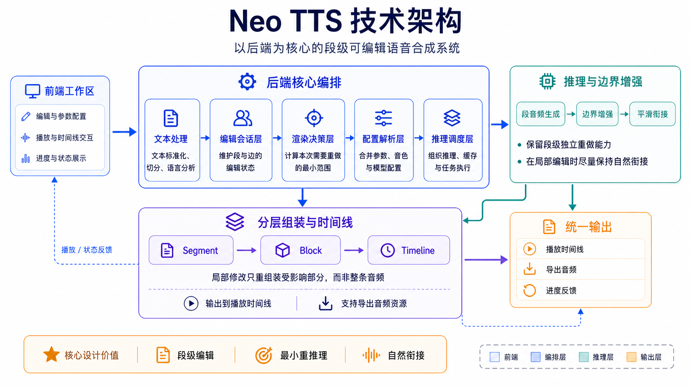

# Neo TTS

> **基于 GPT-SoVITS 的段级可编辑语音合成工作站**

传统的长文本语音合成工具往往以“整篇一次性生成”为主要运行模式，一旦需要修改其中的某句拼音或参数，往往需要对整篇内容重新推理，耗时且难以微调。Neo TTS 围绕这一痛点重新设计了底层架构：将长文本拆分为独立管理的语音段，每段可进行独立推理、编辑和局部重绘，并通过底层的边界融合算法保持段间声学特征的自然衔接，最终高效组装为完整的音频导出。

<a href="https://www.bilibili.com/video/BV13Pd6BMEWh"></a>


<p align="center">
  
</p>

## 核心功能

- **段级编辑**：支持对语音段的插入、追加、修改、删除、交换位置和区间重排
- **局部重推理**：系统自动计算受影响的最小集合，只重做必要部分，不整篇重跑
- **段间衔接控制**：相邻段之间的停顿时长可逐条调节，支持 Latent Overlap 边界融合
- **完整的参数覆盖**：语速、top_k、top_p、temperature、noise_scale 均为段级精度
- **灵活的音色切换**：同一篇文档内可混合多种音色
- **简洁美观的编辑器**：基于 Tiptap 构建，支持行内编辑和双视图切换
- **完善的模型管理**：支持上传并储存自定义权重模型

## 系统要求

### 使用整合包

- **操作系统**：Windows 10 / 11
- **GPU**：NVIDIA GPU（至少 4GB 显存）

### 本地开发部署

在上述基础要求之上，还需要：

- **Python**：3.11（项目通过 [uv](https://docs.astral.sh/uv/) 管理依赖）
- **PyTorch**：后端依赖当前绑定 CUDA 12.8 wheel 源，Windows 驱动版本至少需满足 CUDA 12.x 运行时兼容线 `528.33`
- **Node.js**：18+
- **包管理**：uv（后端）、npm（前端）

## 快速开始

### 整合包

**开箱即用**

### 本地开发部署

#### 1. 安装依赖

```powershell
# 后端
uv sync --group dev

# 前端
Set-Location frontend
npm install
Set-Location ..
```

#### 2. 准备模型与音色配置

编辑 [config/voices.json](config/voices.json)，最小结构如下：

```json
{
  "voice_id": {
    "gpt_path": "pretrained_models/GPT_weights/model.ckpt",
    "sovits_path": "pretrained_models/SoVITS_weights/model.pth",
    "ref_audio": "pretrained_models/reference.wav",
    "ref_text": "参考音频对应文本",
    "ref_lang": "zh",
    "description": "音色描述",
    "defaults": {
      "speed": 1.0,
      "top_k": 15,
      "top_p": 1.0,
      "temperature": 1.0,
      "pause_length": 0.3
    }
  }
}
```

- 手动维护的静态音色由 `config/voices.json` 管理
- 上传到管理页的托管音色会写入 `storage/managed_voices/`

#### 3. 启动

```powershell
# launcher 主入口（推荐）
Set-Location launcher
go run ./cmd/launcher --runtime-mode dev --frontend-mode web

# 兼容入口
Set-Location ..
.\start_dev.bat

# 或分别启动
uv run python -m backend.app.cli --port 18600
Set-Location frontend
$env:VITE_BACKEND_ORIGIN="http://127.0.0.1:18600"
npm run dev
```

补充说明：

- 当前配置优先级是：CLI > 进程环境变量 > `config/launch.json` > 默认值
- 推荐把项目级启动配置写到 `config/launch.json`
- `start_dev.bat` 只保留为源码联调兼容入口，不包含单实例、旧进程清理与守护逻辑
- Go launcher 现在只接受 `dev/web`；`product/electron` 必须由 `desktop` 下的 Electron main 作为正式入口
- `backend.mode=external` 时，launcher 只探活外部后端，不接管也不清理它
- `dev/web` 下由 Go launcher 持有 owner 生命周期；产品态由 Electron main 持有 owner 生命周期
- `runtime-state.json` 与 `exit-request.json` 若存在，也只作为调试快照，不再作为关键控制真相

#### 4. 打开页面

- 前端开发地址：`http://localhost:5175`
- 后端接口文档：`http://127.0.0.1:18600/docs`

## 技术架构



Neo TTS 当前围绕一条主链路组织：**输入稿 -> 编辑会话 -> 段级推理 -> Block 时间线 -> 播放 / 导出**。前端负责输入、编辑、播放和管理入口；后端负责正式会话状态、异步渲染作业、资产与时间线；推理层负责调用 GPT-SoVITS 生成段音频并处理段间衔接。

### 主流程

1. 用户在 `/text-input` 准备文本，前端通过后端标准化 preview 得到权威切分预览，再进入 `/workspace`。
2. Workspace 初始化或修改 edit-session；每次会改变正式音频的操作都会创建 render job。
3. render job 完成后提交新的 `DocumentSnapshot` 和 `TimelineManifest`。前端播放、导出和后续编辑都以这两个正式结果为准，而不是以本地草稿为准。

### 核心设计

- **段与边建模**：长文本被拆成 `Segment`，相邻段之间由 `Edge` 描述停顿和边界策略。这样文本、音频、停顿和重排都可以按段管理。
- **局部重推理**：后端对比前后快照，只找出受影响的段、边和 block。未变化的音频资产继续复用，避免整篇重跑。
- **Block + Timeline**：系统把多个段组装为 block，再生成统一的 sample 级时间线。播放器、正文高亮、跳转和导出都消费同一份时间线，避免前后端各自推算位置。
- **推理与边界增强**：推理运行时基于 PyTorch 版 GPT-SoVITS，并按模型组合缓存引擎。相邻段模型兼容时使用 Latent Overlap 改善衔接；不兼容时回退到普通音频拼接，保证结果可用。
- **配置覆盖**：生成参数和音色绑定按会话、组、段逐层覆盖。渲染前统一解析最终配置，使同一篇文档可以混用不同参数和音色。
- **前端工作区**：当前主入口是 `/text-input`、`/workspace` 和 `/voices`。前端通过 snapshot、timeline、render/export job 和 SSE 进度流同步正式状态。


## 技术栈

| 层 | 技术 |
|---|---|
| 后端 | Python 3.11、FastAPI、Pydantic、Uvicorn |
| 前端 | TypeScript、Vue 3、Vite、Tiptap、Element Plus、Nuxt UI |
| 推理 | GPT-SoVITS（PyTorch）、CNHubert、BERT / transformers |
| 多语言 | pypinyin、opencc、pyopenjtalk、g2p_en、g2pk2、ToJyutping |

## 开源协议

本项目使用 [Apache-2.0 license](LICENSE)。

## 致谢

- [GPT-SoVITS](https://github.com/RVC-Boss/GPT-SoVITS)：本项目的核心语音推理能力基于该开源项目构建，感谢其团队与社区的持续贡献。
