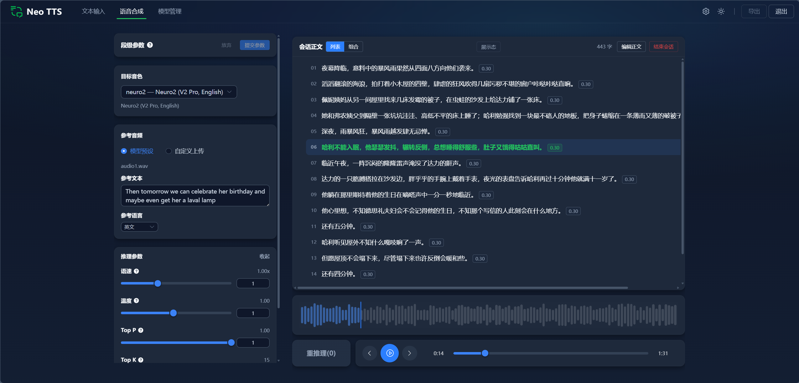

# Neo TTS

> **基于 GPT-SoVITS 的段级可编辑语音合成工具。**

GPT-SoVITS 原生 WebUI 以"整条文本一次性生成"为主要模式，修改任何一句话都需要整篇重跑。Neo TTS 围绕这个痛点重新设计：将长文本拆分为独立管理的语音段，每段独立推理、独立编辑、独立重做，并通过 Latent Overlap 边界增强保持段间自然衔接，最终组装为完整音频导出。


<p align="center">
  
</p>

## 核心特性

### 段级编辑与局部重推理

支持对语音段的插入、追加、修改、删除、交换位置和区间重排。编辑后系统自动计算受影响的最小集合（目标段 + 相邻边界 + 所在块），只重做必要部分，不整篇重跑。

### 段间衔接控制

相邻段之间的停顿时长可逐条调节。边界融合支持三种策略：Latent Overlap + 等功率交叉淡化（默认）、纯交叉淡化、硬拼接。当左右段使用不同音色或不同模型时，系统自动降级为纯交叉淡化。

### 灵活的参数与音色覆盖

生成参数（语速、top_k、top_p、temperature、noise_scale、参考音频）和音色/模型绑定均支持会话级、组级、段级和批量段级覆盖。同一篇文档内可混合多种音色和参数配置。

### 双布局工作区

同一份文本可在列表式（逐段操作）和组合式（整体排布）两种视图之间切换。编辑器基于 Tiptap 构建，段与停顿作为一等结构节点内嵌，支持行内编辑、拖拽重排和右键菜单。

### 统一播放与时间线

播放器基于 Block 级 AudioBuffer 调度，支持点击段跳转、Seek 时交叉淡入淡出。时间线由后端 TimelineManifest 驱动，`useTimeline` 会把当前播放位置统一解析为 segment / boundary / pause / ended 等游标语义，保证正文高亮、控制栏和波形图共用同一播放真源。

### 导出

支持整条成品导出（拼接为单个 WAV）和分段导出（每段一个 WAV + manifest），覆盖最终交付和素材回收两种场景。

### 模型管理

支持查看现有音色、上传托管模型、删除托管模型、刷新配置。手动维护的静态音色（`config/voices.json`）与上传的托管音色（`storage/managed_voices/`）可以共存。

## 系统要求

### 使用整合包（普通用户）

- **操作系统**：Windows 10 / 11
- **GPU**：NVIDIA GPU（8 GB 显存可运行 V2Pro；更大模型按显存需求自行评估）
- **CUDA**：CUDA 11.8+（整合包内置）

### 本地开发部署

在上述基础要求之上，还需要：

- **Python**：3.11（项目通过 [uv](https://docs.astral.sh/uv/) 管理依赖）
- **Node.js**：18+
- **包管理**：uv（后端）、npm（前端）

## 快速开始

### 整合包

> 整合包正在准备中，发布后将提供一键启动的使用说明。

当前产品态正式入口约束：

- 开发态主入口是 `dev/web`
- 打包后的唯一正式产品入口是 Electron 主程序
- Go launcher 只作为开发态 owner，不再承担正式产品入口身份

### 本地开发部署

#### 1. 安装依赖

```powershell
# 后端
uv sync --group dev

# 前端
Set-Location frontend
npm install
Set-Location ..
```

#### 2. 准备模型与音色配置

编辑 [config/voices.json](config/voices.json)，最小结构如下：

```json
{
  "voice_id": {
    "gpt_path": "pretrained_models/GPT_weights/model.ckpt",
    "sovits_path": "pretrained_models/SoVITS_weights/model.pth",
    "ref_audio": "pretrained_models/reference.wav",
    "ref_text": "参考音频对应文本",
    "ref_lang": "zh",
    "description": "音色描述",
    "defaults": {
      "speed": 1.0,
      "top_k": 15,
      "top_p": 1.0,
      "temperature": 1.0,
      "pause_length": 0.3
    }
  }
}
```

- 手动维护的静态音色由 `config/voices.json` 管理
- 上传到管理页的托管音色会写入 `storage/managed_voices/`

#### 3. 启动

```powershell
# launcher 主入口（推荐）
Set-Location launcher
go run ./cmd/launcher --runtime-mode dev --frontend-mode web

# 兼容入口
Set-Location ..
.\start_dev.bat

# 或分别启动
uv run python -m backend.app.cli --port 18600
Set-Location frontend
$env:VITE_BACKEND_ORIGIN="http://127.0.0.1:18600"
npm run dev
```

补充说明：

- 当前配置优先级是：CLI > 进程环境变量 > `config/launch.json` > 默认值
- 推荐把项目级启动配置写到 `config/launch.json`
- `start_dev.bat` 只保留为源码联调兼容入口，不包含单实例、旧进程清理与守护逻辑
- `backend.mode=external` 时，launcher 只探活外部后端，不接管也不清理它
- `dev/web` 下由 Go launcher 持有 owner 生命周期；产品态由 Electron main 持有 owner 生命周期
- `runtime-state.json` 与 `exit-request.json` 若存在，也只作为调试快照，不再作为关键控制真相

#### 4. 打开页面

- 前端开发地址：`http://localhost:5175`
- 后端接口文档：`http://127.0.0.1:18600/docs`

## 技术架构

### 推理引擎与边界增强

推理主线基于 PyTorch-first 的 GPT-SoVITS 运行时（支持 v2 / v2Pro），模型引擎按 `gpt_path + sovits_path` 组合键缓存，避免重复初始化。

每段推理完成后，音频被切分为 **left_margin / core / right_margin** 三段。margin 区域保留了 SoVITS decoder 的 latent frame，用于后续边界增强——这意味着边界重算不需要重推段本身。

**Latent Overlap 边界增强**（核心创新）：利用 SoVITS TextEncoder 已有的 overlap 原语，将左段的 right_margin latent frame 注入右段的解码前缀（`decode_boundary_prefix`），在声学层面实现跨段自然衔接，而非仅靠波形级交叉淡化。当左右段使用不同音色或不同模型时，系统自动降级为纯交叉淡化，避免 latent 空间不兼容。

### 编辑会话模型

系统围绕 **Segment（段）+ Edge（边）** 双实体模型组织编辑状态：

- **Segment** 维护文本、顺序、语言、版本号、音频资产引用和段级参数覆盖
- **Edge** 描述相邻段之间的停顿时长（`pause_duration_seconds`）和边界策略（`boundary_strategy`）

每次编辑提交产生新的 **DocumentSnapshot**（含段列表、边列表、版本号）。**RenderPlanner** 根据编辑类型（update / insert / delete / swap / reorder）对比前后快照，精确计算需要重做的 segment、edge 和 block 集合（`TargetedRenderPlan`），跳过未受影响的部分。

### Block 分层组装

长文档被 **BlockPlanner** 按时长（20-40 秒）和段数上限自动分块。**CompositionBuilder** 逐块组装段音频、边界音频和停顿静音，产出带有采样级标记的 `BlockCompositionAssetPayload`。**TimelineManifestService** 将所有块拼接为全局时间线（`TimelineManifest`），为前端播放器提供段/边界/块的绝对采样位置。

这套三层结构（Segment → Block → Timeline）使得局部编辑只需重组装受影响的块，而非整条音频。

### 参数与模型绑定

**RenderProfile**（生成参数）和 **VoiceBinding**（音色/模型绑定）各自支持会话级 → 组级 → 段级三层覆盖。**RenderConfigResolver** 在渲染前逐段解析最终生效的参数和模型组合，并生成 fingerprint 用于缓存命中判断。

### 文本处理

段文本在生命周期内维护三层口径：

- **raw_text**：用户输入的原始文本（含原始标点）
- **normalized_text**：标准化后的文本（统一句尾强标点）
- **render_text**：送入推理的最终文本（运行时按语言和句尾规则派生，不持久化）

切分策略支持 6 种模式（cut0 – cut5），覆盖按标点、按句号、按字符数等场景。

### 前端架构

- **编辑器**：基于 Tiptap 构建结构化编辑画布，段（`SegmentBlock`）和停顿（`PauseBoundary`）作为自定义 Node 内嵌，支持行内文本编辑、拖拽重排、右键菜单操作
- **播放器**：基于 Web Audio API，按 Block 级 AudioBuffer 调度播放，Seek 时带交叉淡入淡出；`usePlayback` 以 sample 为真源，`useTimeline` 负责解析统一播放游标（segment / boundary / pause），驱动点击跳转、正文高亮、控制栏与波形图联动
- **状态管理**：`useEditSession` 管理会话生命周期，`useWorkspaceLightEdit` 维护段级草稿状态，`useWorkspaceProcessing` 处理渲染作业提交与进度订阅
- **进度流**：初始化和重推理全程通过 SSE 推送段级进度事件，前端实时展示进度条和段状态变更


## 技术栈

| 层 | 技术 |
|---|---|
| 后端 | Python 3.11、FastAPI、Pydantic、Uvicorn |
| 前端 | TypeScript、Vue 3、Vite、Tiptap、Element Plus、Nuxt UI |
| 推理 | GPT-SoVITS（PyTorch）、CNHubert、BERT / transformers |
| 多语言 | pypinyin、opencc、pyopenjtalk、g2p_en、g2pk2、ToJyutping |

## 项目结构

```text
neo-tts/
├─ backend/
│  ├─ app/
│  │  ├─ api/               # FastAPI 路由
│  │  ├─ core/              # settings、lifespan、日志、异常
│  │  ├─ inference/         # GPT-SoVITS 推理运行时与边界增强
│  │  ├─ repositories/      # voice / edit-session 存储访问
│  │  ├─ schemas/           # Pydantic schema
│  │  └─ services/          # segment、edge、render、timeline、export 等核心服务
│  └─ tests/                # 单元、集成、E2E 测试
├─ frontend/
│  ├─ src/
│  │  ├─ api/               # 前端 API client
│  │  ├─ components/        # 输入页、工作区、模型管理组件
│  │  ├─ composables/       # 状态与工作流逻辑
│  │  ├─ router/            # 路由
│  │  ├─ utils/             # 文本与编辑辅助
│  │  └─ views/             # TextInput / Workspace / Studio / VoiceAdmin
│  └─ tests/                # 前端行为测试
├─ desktop/                 # Electron main / preload / 打包骨架（产品态入口）
├─ GPT_SoVITS/              # 上游模型与文本处理代码
├─ launcher/                # Go launcher、构建脚本与 Windows 平台层
├─ config/                  # 音色配置（静态）
├─ storage/                 # 托管音色、会话资产与导出结果
└─ start_dev.bat            # Windows 开发兼容启动脚本
```

## 开源协议

本项目使用 [MIT License](LICENSE)。
