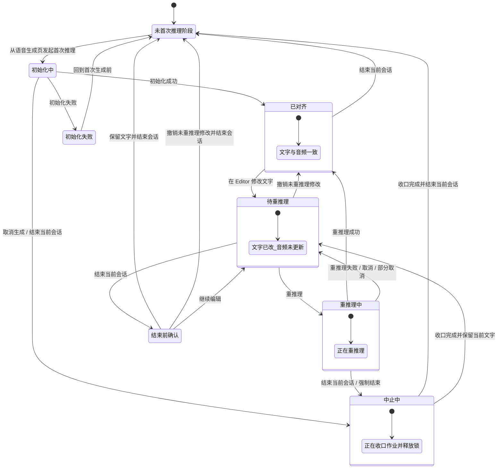
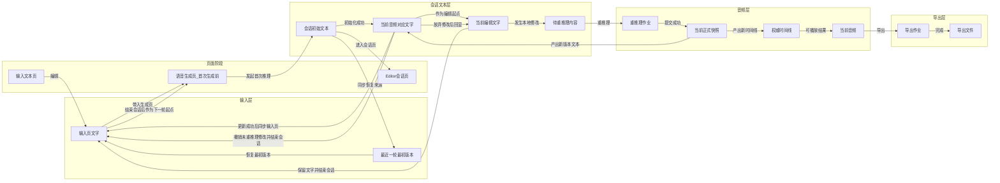

# 系统术语和对应

## 1. 文档目的

本文档用于统一 neo-tts 在文本编辑、音频更新、会话重建、输入回带、版本恢复中的系统概念、内部术语、用户可见命名与旧概念映射。

本文档的目标不是解释现有实现细节，而是给未来产品、交互、接口、状态管理和代码命名提供一套统一语义。

---

## 2. 核心建模原则

### 2.1 面向用户的唯一语义锚点

整个系统对用户只围绕一句话组织：

> 文字改了，但音频还没更新。

但这不意味着系统应该彻底去专业化。

本系统应采用“分层公开术语”策略：

- 新用户先靠结果解释完成基础操作
- 资深用户逐步学习少数关键领域词，建立稳定心智模型
- 只有真正有长期价值的领域词，才值得公开给用户

因此，用户不需要先学习全部内部概念，但必须允许用户逐步学会少量核心词，例如：

- `会话`
- `重推理`
- `最初版本`
- `片段`

所有外部命名都必须能直接落到下面三件事之一：

- 我现在看到的是什么文字
- 当前音频对应的是哪版文字
- 这次操作会不会让音频更新

### 2.1.1 术语公开分层原则

术语统一分为三层：

1. `公开核心术语`
用户会反复看到，并且后续操作必须依赖理解的领域词。

2. `公开解释型文案`
用于帮助新用户立即理解动作后果，不要求用户背术语。

3. `内部技术术语`
用于代码、接口、日志、存储和架构讨论，不直接暴露给普通用户。

判断一个词是否应升级为“公开核心术语”，至少应满足以下条件中的三项：

- 会在多个页面反复出现
- 用户后续操作真正依赖它
- 与系统内部对象一一对应
- 如果不用它，解释反而更长
- 资深用户需要靠它自行探索功能

### 2.1.2 页面位置不是动作语义

本系统至少存在三个用户可感知阶段：

1. `输入文本页`
只负责准备和修改输入页文字。

2. `语音生成页`
负责调参数、选择音色、启动首次推理。

3. `Editor 会话页`
负责会话内编辑、重推理、播放和导出。

因此，用户在 Editor 中点击“结束会话”时，系统真实发生的是：

- 结束当前正式会话
- 销毁当前音频、时间线和正式版本上下文
- 退回到语音生成页的`未首次推理阶段`

这不等于“返回输入文本页”。

### 2.2 文本不是单一对象，而是四个不同作用域的对象

系统中的“文本”必须拆成四类，禁止再用单个“正文”或“草稿”统称：

1. `输入页文本`
这是输入页当前保存的文本，代表“下一次初始化或重建会话要使用的文本”。

2. `会话初始文本`
这是当前会话第一次创建时使用的原始全文，作为“恢复最初版本”的来源。

3. `当前音频对应文字`
这是当前会话里已经提交成功、并与当前音频和时间线严格对应的文本。

4. `当前编辑文字`
这是 Editor 当前看到并允许修改的文字。它可以先于音频变化，因此不必天然等于“当前音频对应文字”。

### 2.3 音频永远只对应已提交版本

系统中的当前音频、时间线、导出对象，只能对应已经提交到当前会话的版本，不能对应本地未提交修改。

因此：

- 改字不会自动更新音频
- 只有“重推理”成功，文字修改才升级为当前会话的正式结果
- 本地未重推理修改不能伪装成当前会话已经生效的结果

### 2.4 Editor 是工作区，不是正式结果本体

Editor 的职责是维护当前编辑文字。

它可以：

- 实时编辑
- 本地自动保存
- 标记哪些片段需要重推理

但它不能单方面定义当前会话的正式文本结果。当前会话的正式文本结果只能来自成功提交后的版本快照。

### 2.5 “结束会话”不是“恢复最初版本”

这两个动作必须严格分离：

- `结束会话`：结束当前会话，清掉当前会话的正式结果与运行态，并退回到语音生成页的未首次推理阶段
- `恢复最初版本`：把输入页文本恢复成当前会话第一次创建时使用的原始全文

它们解决的是两个不同问题，不能互相替代。

这里还需要额外区分一层：

- `结束当前会话` 清理的是正式会话与运行态
- `恢复最初版本` 依赖的是跨会话缓存下来的“最近一轮最初版本”

因此，结束当前会话不等于立刻抹除一切文本来源；只要产品仍提供“恢复最初版本”入口，就必须单独保留恢复来源缓存。

### 2.6 “保留文字并结束会话”是文本交接，不是当前会话提交

当用户在结束当前会话前选择保留修改时，系统做的是：

- 将当前编辑文字写回输入页文本
- 然后结束当前会话
- 并退回到语音生成页的未首次推理阶段

这不意味着：

- 当前会话的音频已更新
- 当前会话的正式文本已改写

这只是一次跨页面、跨会话的文本交接。

---

## 3. 主要概念解析

### 3.1 输入页文本

输入页文本是用户在文本输入页看到和编辑的文本。

它的系统职责是：

- 作为新会话初始化的输入
- 作为“结束当前会话后保留当前编辑结果”的承接位置
- 作为跨会话存在的文本缓冲区

它不保证一定对应当前会话音频。

### 3.2 会话初始文本

会话初始文本是当前会话创建时的全文原文，是本次会话的文本基线。

它的职责是：

- 表示“这轮会话最开始是从哪份文字开始的”
- 支撑“恢复最初版本”
- 在需要解释“当前编辑已经偏离最初版本多少”时提供参照

它是会话级只读对象，不会随着本地编辑而变化。

### 3.2.1 最近一轮最初版本

最近一轮最初版本是从会话初始文本同步出来、保存在输入页侧的跨会话恢复来源。

它的职责是：

- 支撑“结束当前会话并退回生成准备后，输入页仍可恢复最初版本”
- 避免把恢复能力错误地绑定到仍然存活的正式会话上

它不是正式会话的一部分，而是页面交接阶段保留的恢复缓存。

### 3.3 当前音频对应文字

当前音频对应文字是当前会话中已经完成提交、并且与当前音频、时间线、导出对象严格一致的文字版本。

它的职责是：

- 作为当前正式结果的文本描述
- 作为导出、播放、跳转、边界编辑等逻辑的权威文本版本
- 作为放弃本地修改时的回退目标

### 3.4 当前编辑文字

当前编辑文字是 Editor 当前工作副本里的有效全文。

它的职责是：

- 承接用户本地实时修改
- 作为“是否需要重推理”的直接判断来源
- 在选择“保留文字并结束会话”时作为回填输入页的来源

它可以和当前音频对应文字不同。

### 3.5 待重推理内容

待重推理内容是“当前编辑文字”和“当前音频对应文字”之间的差异集合。

它可以体现在：

- 全文级差异
- 分段级差异
- Badge 或提醒文案

它的本质是“当前会话还没把这些文字变化通过重推理更新到音频里”。

### 3.6 当前音频

当前音频是当前会话中可播放、可导出、可寻址的正式结果。

它必须总是来源于：

- 当前正式版本
- 当前权威时间线

而不是来源于 Editor 本地工作副本。

### 3.7 当前会话

当前会话是承载一次编辑推理周期的正式容器，包含：

- 会话初始文本
- 当前音频对应文字
- 当前音频和时间线
- 参数、边、分组、绑定、checkpoint、导出上下文

结束当前会话意味着销毁这层正式上下文，而不是自动恢复最初版本。

---

## 4. 内部术语表

| 内部术语 | 建议英文 ID | 所属层 | 定义 | 典型来源 / 持久化 |
| --- | --- | --- | --- | --- |
| 输入页文本 | `input_text` | 客户端跨会话层 | 输入页当前保存的文本，代表下一次初始化要使用的文本 | `useInputDraft().text` |
| 输入来源 | `input_text_source` | 客户端跨会话层 | 输入页文本当前来自手动输入、会话回填还是输入回带 | `useInputDraft().source` |
| 会话初始文本 | `session_initial_text` | 会话基线层 | 当前会话第一次创建时的原始全文，不随本地编辑变化 | `source_text`，`initialize_request.raw_text` |
| 最近一轮最初版本 | `last_session_initial_text` | 客户端跨会话层 | 从会话初始文本同步出来、供输入页“恢复最初版本”使用的恢复来源缓存 | 输入页本地状态 / 会话交接缓存 |
| 当前音频对应文字 | `applied_text` | 会话正式层 | 当前会话里已提交成功并与当前音频严格对应的文本 | head snapshot `raw_text`，segments `raw_text` |
| 当前编辑文字 | `working_text` | 本地工作层 | Editor 当前工作副本里的有效全文 | `sourceDoc` / `effectiveText` |
| 待重推理内容 | `pending_updates` | 本地工作层 | `working_text` 相对 `applied_text` 的差异集合 | 本地 diff 计算结果 |
| 待重推理片段集 | `pending_segment_set` | 本地工作层 | 当前需要重推理的片段集合 | `dirtySegmentIds` 的新概念 |
| 工作副本文档 | `working_copy_doc` | 本地工作层 | Editor 的结构化工作副本，用于维护段、停顿边界和布局 | `sourceDoc` / `editorDoc` |
| 工作副本快照 | `working_copy_snapshot` | 本地工作层 | 本地持久化的 Editor 工作状态 | `WorkspaceDraftSnapshot` |
| 会话基线快照 | `baseline_snapshot` | 会话正式层 | 会话首次成功初始化后的正式基线版本 | backend baseline snapshot |
| 当前正式快照 | `head_snapshot` | 会话正式层 | 当前会话最新正式提交版本 | backend head snapshot |
| 当前文档版本 | `document_version` | 会话正式层 | 当前正式快照的版本号，每次正式提交递增 | `document_version` |
| 权威时间线 | `timeline_manifest` | 音频正式层 | 当前正式版本的播放、拼接、寻址权威视图 | `TimelineManifest` |
| 当前音频 | `active_audio` | 音频正式层 | 当前时间线对应的可播放正式音频结果 | time line + rendered assets |
| 重推理作业 | `apply_updates_job` | 异步作业层 | 将待重推理内容应用到当前音频的作业 | render job: update / rerender / resume |
| 导出作业 | `export_job` | 异步作业层 | 将当前正式时间线导出为分段或组合文件的作业 | export job |
| 输入回带 | `input_handoff` | 页面交接层 | 将当前编辑文字写回输入页文本的动作 | 结束会话前的保留修改分支 |
| 会话结束 | `end_session` | 页面交接层 | 删除当前正式会话及其运行态，使系统退回到语音生成页的未首次推理阶段 | current `clearSession` |
| 未首次推理阶段 | `generation_pre_init` | 页面阶段层 | 没有正式会话、但用户仍在语音生成页可调参数并准备启动首次推理的状态 | `sessionStatus = empty` 的语义外显 |
| 恢复最初版本 | `restore_initial_text` | 页面交接层 | 用当前会话初始文本覆盖输入页文本 | 未来输入页入口 |

### 4.1 内部状态归一

| 状态域 | 内部状态 | 含义 |
| --- | --- | --- |
| 会话状态 | `empty` | 当前没有正式会话 |
| 会话状态 | `initializing` | 会话正在首次生成 |
| 会话状态 | `ready` | 当前会话可用，可编辑、可播放、可导出 |
| 会话状态 | `failed` | 会话初始化失败 |
| 编辑状态 | `aligned` | `working_text == applied_text` |
| 编辑状态 | `pending_updates` | `working_text != applied_text` |
| 编辑状态 | `applying_updates` | 正在将修改更新到音频 |
| 编辑状态 | `apply_failed` | 重推理失败，`working_text` 仍保留，本次提交未生效 |
| 运行控制状态 | `aborting` | 正在中止初始化或重推理作业，并准备退出或回到可编辑状态 |

### 4.2 后台 render job 状态归一

| Render Job 原始状态 | 归一语义 |
| --- | --- |
| `queued` / `preparing` | 等待重推理 |
| `rendering` / `composing` / `committing` | 正在重推理 |
| `paused` / `pause_requested` | 更新被挂起 |
| `cancel_requested` / `cancelled_partial` | 更新被取消或部分取消 |
| `completed` | 更新完成，已生成新的正式版本 |
| `failed` | 更新失败，当前正式版本不变 |

---

## 5. 三层词汇体系

### 5.1 公开核心术语

这些词允许并鼓励直接对用户公开。它们不是纯技术细节，而是用户值得学会的领域概念。

| 公开核心术语 | 用途 | 用户为何必须理解 | 备注 |
| --- | --- | --- | --- |
| 会话 | 组织一轮编辑、音频、参数和导出的正式容器 | 用户后续一定会遇到“结束当前会话 / 会话失败 / 会话恢复” | 必须公开 |
| 重推理 | 把修改重新应用到音频的正式动作 | 用户必须理解“改字后不会自动生效，必须重推理” | 必须公开 |
| 当前文字 | 用户当前正在编辑和看到的文字 | 用户需要知道自己改的是哪一层 | 面向结果的公开词 |
| 当前音频 | 当前会话里可播放的正式结果 | 用户需要知道现在听到的是哪一层 | 面向结果的公开词 |
| 待重推理 | 当前文字已改，但音频还没跟上 | 用户需要知道自己还有未生效改动 | 替代“脏段” |
| 最初版本 | 当前会话最开始使用的文字版本 | 用户需要理解恢复入口的目标 | 比 baseline 更适合公开 |
| 片段 | 局部修改、局部重推理、局部提示的基本对象 | 用户需要理解“不是整篇都要重跑” | 可按界面情况替换成“段落” |

### 5.2 公开解释型文案

这些文案围绕公开核心术语做解释，目标是让新用户不学完整概念也能正确操作。

| 场景 | 推荐文案 |
| --- | --- |
| 主提醒 | 文字改了，但音频还没更新 |
| 片段 hover / tooltip | 这段文字已修改，需要重推理后才会更新到音频 |
| 片段 badge | 待重推理 |
| 主按钮主文案 | 重推理 |
| 主按钮副文案 | 只处理改过的片段 |
| 主按钮数量提示 | 重推理 2 处修改 |
| 结束会话入口辅助说明 | 结束后回到首次生成前 |
| 结束会话前弹窗标题 | 这些修改还没重推理到音频 |
| 结束会话前弹窗说明 | 若存在未生效修改，弹窗必须明确说明“现在结束会话，这些修改不会进入当前音频”；只有存在文字改动时才提供 `保留文字` 分支。 |
| 保留文字并结束会话按钮说明 | 弹窗按钮可简写为 `保留文字`，但只应在存在文字改动时出现，语义仍是“保留文字并结束会话” |
| 结束会话确认说明 | 结束当前会话后，将回到首次生成前 |
| 恢复入口说明 | 回到本次会话开始时的文字 |

### 5.3 面向用户的对象与动作命名

| 对象 / 动作 | 推荐命名 | 说明 | 不建议优先使用 |
| --- | --- | --- | --- |
| 输入页当前文本 | 输入页文字 | 明确这是输入页里的文本 | 输入稿 |
| Editor 当前显示文本 | 当前文字 | 表示用户现在正在改的文字 | 正文、草稿 |
| 当前播放结果 | 当前音频 | 直接锚定用户能听到的对象 | 正式结果、当前版本音轨 |
| 当前有未提交修改 | 待重推理 | 表示文字已改，但音频还没跟上 | 脏段、未更新内容 |
| 片段级提醒 | 待重推理 | 分段 badge，同步建立领域心智 | dirty、需更新 |
| 会话最开始的文字 | 最初版本 | 适合恢复入口与版本说明 | baseline、原版 |
| 将当前修改应用到当前音频 | 重推理 | 真实反映系统行为 | 更新音频 |
| 放弃本地未提交修改 | 撤销未重推理修改并结束会话 | 明确只撤销尚未重推理成功的部分，并结束本轮会话 | 放弃修改 |
| 离开工作区的入口 | 结束会话 | 面向动作语义，不强调页面跳转 | 返回输入页 |
| 破坏性确认动作 | 结束当前会话 | 面向语义边界 | 清空会话 |
| 结束会话前保留修改到下一轮 | 保留文字并结束会话 | 保留当前文字为下一次生成起点，但不提交当前会话 | 带草稿清空、带回输入页 |
| 保持当前会话不结束 | 继续编辑 | 取消本次结束会话动作 | 取消清空 |
| 把输入页恢复成当前会话的最初文字 | 恢复最初版本 | 公开层允许用户理解“版本” | 恢复原版 |
| 会话结束后的生成页状态 | 首次生成前 | 对用户解释“会结束到哪里”时使用 | 无会话 |

### 5.4 内部技术术语

这些术语保留给代码、接口、日志、存储和架构文档使用，不直接暴露给普通用户。

| 内部技术术语 | 是否保留 | 说明 |
| --- | --- | --- |
| `baseline snapshot` | 保留 | 后端和内部设计术语，不直接给普通用户看 |
| `head snapshot` | 保留 | 当前正式版本的内部术语 |
| `working_copy_doc` | 保留 | Editor 工作副本的内部术语 |
| `working_copy_snapshot` | 保留 | 本地自动保存的内部术语 |
| `timeline manifest` | 保留 | 系统权威播放对象的内部术语 |
| `document_version` | 保留 | 版本治理需要，普通用户通常无需理解 |
| `render job` | 保留 | 技术与日志术语；公开层用“重推理中”表达 |
| `export job` | 保留 | 技术与日志术语；公开层用“导出中”表达 |
| `dirtySegmentIds` / `pending_segment_set` | 保留 | 仅内部状态与实现层使用 |

---

## 6. 旧概念到新概念的映射表

### 6.1 旧产品概念映射

| 旧概念 | 问题 | 新系统概念 | 新的对外表达 | 处理策略 |
| --- | --- | --- | --- | --- |
| 正文 | 同时可能指输入页文本、当前音频对应文字、Editor 当前文字 | 按上下文拆成 `input_text` / `applied_text` / `working_text` | 输入页文字 / 当前音频对应文字 / 当前文字 | 废弃单独使用 |
| 草稿 | 同时可能指输入页文本、Editor 本地工作副本 | 按上下文拆成 `input_text` / `working_text` / `working_copy_snapshot` | 输入页文字 / 当前文字 / 本地自动保存 | 废弃单独使用 |
| 脏段 | 只对实现者有意义，用户难以直接理解 | `pending_segment_set` | 待重推理 | 对外替换 |
| 重推理 | 是领域内高价值概念，值得公开保留 | `apply_updates_job` | 重推理 | 保留并配解释文案 |
| 清空会话 | 听上去像删文本，实际语义更接近结束当前轮次 | `end_session` | 结束当前会话 | 对外替换 |
| 返回输入页 | 把页面位置误当成动作语义，掩盖了真实状态转移 | `end_session` | 结束会话 / 结束当前会话 | 对外替换 |
| 保留草稿清空 | 极易被误解为“已经正式保存” | `input_handoff + end_session` | 保留文字并结束会话 | 对外替换 |
| 全部放弃 | 没说明放弃的是什么 | `discard pending updates` | 撤销未重推理修改并结束会话 | 对外替换 |
| 恢复原版 | 不清楚是恢复当前正式版还是会话最初版 | `restore_initial_text` 或 `restore_baseline` | 恢复最初版本 | 拆分后使用 |
| 文本快照 | 不清楚是 baseline、head 还是本地快照 | `baseline_snapshot` / `head_snapshot` / `working_copy_snapshot` | 一般不直接展示 | 废弃模糊说法 |
| 会话正文 | 混淆当前正式文本和 Editor 当前文本 | `applied_text` | 当前音频对应文字 | 对外替换 |

### 6.2 现有实现概念映射

| 现有实现名 | 当前实际含义 | 新内部概念 | 后续建议 |
| --- | --- | --- | --- |
| `inputDraft.text` | 输入页当前文本 | `input_text` | 保留实现，概念重命名 |
| `inputDraft.source = manual` | 用户手动输入来源 | `input_text_source = manual` | 保留 |
| `inputDraft.source = session` | 会话正式结果回填到输入页 | `input_text_source = applied_text` | 建议概念重命名 |
| `inputDraft.source = workspace` | Editor 工作文本回填到输入页 | `input_text_source = input_handoff` | 建议概念重命名 |
| `source_text` | 会话创建时的原始全文 | `session_initial_text` | 保留语义，避免继续叫 source text |
| `initialize_request.raw_text` | 会话初始化原文 | `session_initial_text_source` | 作为底层来源 |
| 输入页恢复来源缓存 | 当前未显式建模 | `last_session_initial_text` | 建议新增单独持久化或交接缓存 |
| `currentSessionHeadText` | 当前正式文本 | `applied_text` | 建议概念重命名 |
| head snapshot | 当前正式版本 | `head_snapshot` | 保留 |
| baseline snapshot | 会话初始正式版本 | `baseline_snapshot` | 保留 |
| `sourceDoc` | Editor 当前工作副本文档 | `working_copy_doc` | 建议概念重命名 |
| `editorDoc` | Editor 视图文档 | `editor_view_doc` | 保留实现层含义 |
| `sourceDocSegmentDrafts` | 工作副本与正式文本的差异 | `pending_updates` | 建议概念重命名 |
| `dirtySegmentIds` | 待重推理片段集合 | `pending_segment_set` | 建议概念重命名 |
| `lightEdit` | 本地待重推理状态容器 | `pending_update_store` | 建议概念重命名 |
| `WorkspaceDraftSnapshot` | 工作区本地自动保存快照 | `working_copy_snapshot` | 建议概念重命名 |
| `effectiveText` | 工作副本的全文有效文本 | `working_text` | 建议概念重命名 |
| `updateSegment` / `rerenderSegment` | 把修改应用到正式结果 | `apply_updates_job` | UI 统一叫“重推理” |
| `clearSession` | 删除当前正式会话 | `end_session` | UI 统一叫“结束当前会话” |
| `resolveWorkspaceEntryAction = rebuild` | 输入页文本领先于当前会话，需要重建会话 | `reinitialize_session_from_input_text` | 对外说“用输入页文字开始新会话” |
| `restore-baseline` | 将当前会话恢复到初始正式版本 | `restore_baseline` | 与“恢复最初版本”区分 |

### 6.3 公开层与内部层边界

| 术语 | 公开策略 | 说明 |
| --- | --- | --- |
| 会话 | 公开 | 用户必须学会 |
| 重推理 | 公开 | 用户必须学会 |
| 最初版本 | 公开 | 恢复入口依赖 |
| 片段 / 段落 | 公开 | 支撑局部操作理解 |
| baseline snapshot | 内部保留 | 不直接给普通用户看 |
| head snapshot | 内部保留 | 不直接给普通用户看 |
| timeline manifest | 内部保留 | 公开层只表达为当前音频 / 时间线 |
| document_version | 内部保留 | 资深用户可通过开发工具了解，不放主界面 |

---

## 7. 核心规则

### 7.1 输入页同步规则

1. 普通编辑过程中，不把当前编辑文字自动回写到输入页文字。
2. 重推理成功后，把新的当前音频对应文字回写到输入页文字。
3. 用户选择“保留文字并结束会话”并成功结束会话后，把当前编辑文字回写到输入页文字。
4. 用户选择“撤销未重推理修改并结束会话”时，不带本地未提交修改；输入页文字应回到当前音频对应文字。
5. 用户点击“恢复最初版本”时，用最近一轮最初版本覆盖输入页文字。
6. 用户在文本输入页点击“清空”时，产品语义固定为“同时清空输入页文字并结束当前会话”；不再提供“只清空输入页文字但保留当前会话”的分支。

对应的确认文案应明确提示破坏性后果，例如：

- `这会同时清空输入框和当前会话，请先导出音频后再清空`
6. 用户在输入页主动清空文字时，若当前仍存在正式会话，系统必须额外确认是否同时结束当前会话；只有用户明确选择同步清理时，才会把输入页与当前会话一起清空。

### 7.2 Editor 规则

1. Editor 永远编辑当前编辑文字。
2. 当前编辑文字允许与当前音频对应文字暂时不一致。
3. 任何本地编辑都可以本地自动保存。
4. 本地自动保存不等于当前会话正式提交，也不等于重推理成功。

### 7.3 音频规则

1. 当前音频只能来源于当前正式快照。
2. 当前时间线只能来源于当前正式快照。
3. 导出只能基于当前时间线和当前正式快照。
4. 本地待重推理内容不能直接影响当前音频和导出结果。

### 7.4 会话结束规则

1. 结束会话的本质是结束当前正式会话，并退回到语音生成页的未首次推理阶段。
2. 用户每次结束会话前都必须先经过显式确认；如果当前没有待重推理内容，系统仍需确认“结束当前会话”这个破坏性动作。
3. 如果存在待重推理内容或未提交参数草稿，确认弹窗必须升级；只有存在文字改动时才提供“保留文字”分支。
4. “保留文字并结束会话”不会更新当前音频，只会把当前编辑文字带入下一轮。
5. “撤销未重推理修改并结束会话”只丢弃未更新到音频的那部分修改；已经成功重推理到音频的结果保留为当前正式结果。
6. “保留文字并结束会话”不应被包装成传统意义上的“保存进度”。如果跨会话重新生成无法复用当前会话音频结果或会带来额外耗时 / 计费风险，产品必须在该动作上显式告警。

### 7.5 运行中作业中断规则

1. 初始化中和重推理中都必须支持外部中止事件。
2. 当用户在运行中请求结束当前会话、强制退出或切换到互斥操作时，系统必须先进入 `aborting`。
3. `aborting` 的职责是收口活跃作业、释放锁、避免孤儿任务和状态锁死。
4. `aborting` 完成后，系统只能进入两类目标状态：
   - 回到语音生成页的未首次推理阶段
   - 回到可编辑但仍有待重推理内容的状态

---

## 8. 核心编辑推理状态机

### 8.1 状态机解释

- `已对齐` 表示当前文字和当前音频对应文字一致。
- `待重推理` 表示当前文字已经改动，但音频仍停留在旧版本。
- `重推理中` 是把本地修改通过重推理应用到当前音频的提交阶段。
- `结束前确认` 只在“结束当前会话”前且存在待重推理内容时出现。
- `未首次推理阶段` 是语音生成页上的无会话状态，不是输入文本页。

---

## 9. 文本、音频生命周期图

### 9.1 生命周期解释

- 输入页文字是下一轮的起点，不等于当前会话正式结果。
- 结束当前会话后，系统退回的是语音生成页的首次生成前状态，而不是自动跳回输入文本页。
- 会话初始文本是当前会话开始时的文本基线。
- 最近一轮最初版本是输入页侧的恢复来源缓存，不属于当前正式会话本体。
- 当前编辑文字是用户实时操作对象。
- 当前音频对应文字和当前音频必须通过重推理同步提交、同步推进。
- 保留文字并结束会话是一条跨会话回路，不会更新当前音频。
- 重推理成功和撤销未重推理修改并结束会话，都会把当前音频对应文字回流给输入页。

---

## 10. 推荐落地约束

### 10.1 产品文案约束

- 用户可见文案默认禁止直接使用：`正文`、`草稿`、`脏段`、`快照`、`head`、`baseline`、`manifest`
- 用户可见文案优先使用：`会话`、`重推理`、`当前文字`、`当前音频`、`待重推理`、`结束会话`、`结束当前会话`、`保留文字并结束会话`、`撤销未重推理修改并结束会话`、`恢复最初版本`

### 10.2 代码命名约束

未来新增代码建议优先采用本文档中的内部术语，不再围绕 `draft / dirty / rerender / clearSession` 做新命名扩散。

### 10.3 文档命名约束

今后凡是涉及文本与音频关系的设计文档，都应以本文档为术语基线；若出现与本文档冲突的旧词，应先映射到本文档语义后再继续写设计。

---

## 11. 最终统一口径

如果要把整套系统压缩成一句最稳定的话，统一口径是：

> Editor 改的是当前文字；只有重推理完成，这些修改才会进入当前会话并变成当前音频对应的结果；如果现在不想重推理，也可以保留这些文字并结束会话，回到首次生成前，留到下一轮再生成。
